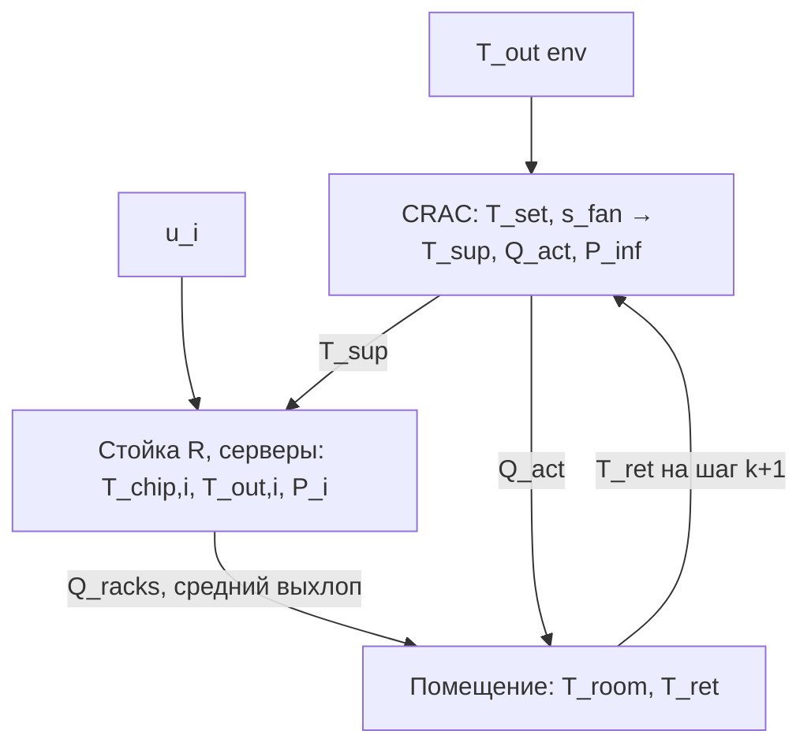

# Цифровой двойник ЦОД и ML-контур

Репозиторий объединяет **физико-ориентированный симулятор** серверного помещения (`DC_digital_twin`), **три ML-сервиса** (прогноз нагрузки, гибридный PUE, прогноз температуры серверов) и **оркестратор** замкнутого управления.

Полная формализация с обозначениями и таблицей параметров — в LaTeX: [`DC_digital_twin/docs/mathematical_model.tex`](DC_digital_twin/docs/mathematical_model.tex).

Ниже — **математическая схема** двойника в компактном виде (формулы в нотации, согласованной с реализацией).

---

## Время и шаг симуляции

Время дискретно:

$$
t_{k+1} = t_k + \Delta t,\qquad k = 0,1,2,\ldots
$$

где $\Delta t$ — шаг модельного времени (секунды), задаётся конфигом/API (`simulator.time_step` или `delta_time` в запросе шага).

---

## Генератор нагрузки

Для каждого сервера $i = 1,\ldots,N$ задаётся утилизация $u_i^{(k)} \in [0,1]$ (случайный, периодический, датасет и т.д. — см. код `load_generator`).

---

## Стойка и рециркуляция

Пусть $\mathbf{T}_{\mathrm{out}} = (T_{\mathrm{out},1},\ldots,T_{\mathrm{out},N})^\top$. Задана матрица рециркуляции $\mathbf{R} \in \mathbb{R}^{N\times N}$ (зависит от `containment`: hot_aisle / cold_aisle / none).

Температура на входе $i$-го сервера:

$$
T_{\mathrm{in},i} = T_{\mathrm{sup}} + \sum_{j=1}^{N} R_{ij}\,(T_{\mathrm{out},j} - T_{\mathrm{sup}}).
$$

---

## Модель сервера

**Мощность** (вся идёт в тепло):

$$
P_i = P_{\mathrm{idle}} + (P_{\mathrm{max}} - P_{\mathrm{idle}})\, u_i .
$$

**Тепло, передаваемое воздуху** ($\varepsilon$ — эффективность теплообменника, $\dot m_{\mathrm{srv}}$ — эквивалентный расход воздуха, $c_p$ — удельная теплоёмкость воздуха):

$$
\dot Q_{\mathrm{air},i} = \dot m_{\mathrm{srv}}\, c_p\, \varepsilon\, \max\bigl(0,\; T_{\mathrm{chip},i} - T_{\mathrm{in},i}\bigr).
$$

**Баланс чипа** (явная схема Эйлера, $C_{\mathrm{th}}$ — теплоёмкость чипа):

$$
T_{\mathrm{chip},i}^{(k+1)} = T_{\mathrm{chip},i}^{(k)} + \Delta t\,\frac{P_i - \dot Q_{\mathrm{air},i}}{C_{\mathrm{th}}}.
$$

**Температура воздуха на выходе** (модель теплообменника):

$$
T_{\mathrm{out},i} = T_{\mathrm{in},i} + \varepsilon\,\bigl(T_{\mathrm{chip},i} - T_{\mathrm{in},i}\bigr).
$$

**Вентилятор сервера** (эвристика, $T_{\max}$ из конфига, $D_i = T_{\max} - T_{\mathrm{in},i}$):

$$
s_{\mathrm{fan},i}^{\mathrm{srv}} = \mathrm{clip}\left( \frac{T_{\mathrm{chip},i} - T_{\mathrm{in},i}}{D_i}\cdot 1.2,\; 0.3,\; 1 \right).
$$

---

## Контур охлаждения CRAC

Связка с помещением: эффективная температура возврата может учитывать и зал (в коде используется согласование $T_{\mathrm{ret}}$ с $T_{\mathrm{room}}$ там, где это нужно для теплобаланса).

**Потребность по воздушной стороне** ($\dot m_{\mathrm{air}}$ — массовый расход контура CRAC, $T_{\mathrm{ret}}$ — возврат, $T_{\mathrm{sup}}^{\mathrm{tgt}}$ — целевая подача):

$$
Q_{\mathrm{req}} = \dot m_{\mathrm{air}}\, c_p\, \max\bigl(0,\; T_{\mathrm{ret}} - T_{\mathrm{sup}}^{\mathrm{tgt}}\bigr).
$$

**Доступная холодопроизводительность** ($Q_{\mathrm{cap}}$ — номинал, $s_{\mathrm{fan}} \in [0,1]$ — вентиляторы CRAC):

$$
Q_{\mathrm{avail}} = Q_{\mathrm{cap}}\, s_{\mathrm{fan}}.
$$

**Фактический отбор** $Q_{\mathrm{act}} = \min(Q_{\mathrm{req}}, Q_{\mathrm{avail}})$ с уточнением по режимам `free` / `chiller` / `mixed` (см. полный документ).

**Температура подачи** в стойку после катушки:

$$
T_{\mathrm{sup}} = T_{\mathrm{ret}} - \frac{Q_{\mathrm{act}}}{\dot m_{\mathrm{air}}\, c_p}
$$

(в коде знаменатель защищён от нуля).

**COP** чиллера по наружной температуре $T_{\mathrm{out}}$ ($a,b,c$ — `cop_curve`):

$$
\mathrm{COP}(T_{\mathrm{out}}) = \max\bigl(1,\; a T_{\mathrm{out}}^2 + b T_{\mathrm{out}} + c\bigr).
$$

**Мощность вентиляторов CRAC** ($P_{\mathrm{fan}}^{\max}$ — `max_power`, закон `cubic` или `linear`):

$$
P_{\mathrm{fan}} =
\begin{cases}
P_{\mathrm{fan}}^{\max}\, s_{\mathrm{fan}}^3, & \text{cubic},\\[6pt]
P_{\mathrm{fan}}^{\max}\, s_{\mathrm{fan}}, & \text{linear}.
\end{cases}
$$

Электрическая мощность охлаждения в телеметрии собирается из $Q_{\mathrm{act}}/\mathrm{COP}$ (где применимо) и $P_{\mathrm{fan}}$ в зависимости от режима.

---

## Модель помещения

**Теплоёмкость** воздуха зала ($V$ — объём, $\rho_{\mathrm{air}}$ — плотность, $f_{\mathrm{mass}}$ — множитель):

$$
C_{\mathrm{room}} = V\, \rho_{\mathrm{air}}\, c_p\, f_{\mathrm{mass}}.
$$

**Теплопотери** и слабый обмен с подачей ($UA$ — `wall_heat_transfer`, $G_{\mathrm{mix}}$ — `supply_mixing_conductance`):

$$
Q_{\mathrm{wall}} = UA\,(T_{\mathrm{out}}^{\mathrm{env}} - T_{\mathrm{room}}), \qquad
Q_{\mathrm{mix}} = G_{\mathrm{mix}}\,(T_{\mathrm{sup}} - T_{\mathrm{room}}).
$$

**Суммарное тепло от стоек** $Q_{\mathrm{racks}} = \sum_i P_i$. Обновление температуры зала:

$$
T_{\mathrm{room}}^{(k+1)} = T_{\mathrm{room}}^{(k)}
+ \frac{\Delta t}{C_{\mathrm{room}}}\,\Bigl(Q_{\mathrm{racks}} + Q_{\mathrm{wall}} + Q_{\mathrm{mix}} - Q_{\mathrm{act}}\Bigr).
$$

**Возвратный воздух** (средний выхлоп стойки $\overline{T_{\mathrm{out}}} = \frac{1}{N}\sum_i T_{\mathrm{out},i}$, доля обновления $\alpha$ от массы зала и $\dot m_{\mathrm{air}}\,\Delta t$):

$$
T_{\mathrm{ret}}^{\mathrm{tgt}} = 0.65\,\overline{T_{\mathrm{out}}} + 0.35\, T_{\mathrm{room}}, \qquad
T_{\mathrm{ret}}^{(k+1)} = T_{\mathrm{ret}}^{(k)} + \alpha\,\bigl(T_{\mathrm{ret}}^{\mathrm{tgt}} - T_{\mathrm{ret}}^{(k)}\bigr).
$$

(Точное определение $\alpha$ — в `mathematical_model.tex`.)

---

## PUE и риск перегрева

$$
P_{\mathrm{IT}} = \sum_{i=1}^{N} P_i, \qquad
\mathrm{PUE} = \frac{P_{\mathrm{IT}} + P_{\mathrm{inf}}}{P_{\mathrm{IT}}}\quad (P_{\mathrm{IT}}>0),
$$

где $P_{\mathrm{inf}}$ — мощность инфраструктуры охлаждения из расчёта `compute_total_power`.

**Риск перегрева** (доля серверов с $T_{\mathrm{chip},i} > T_{\mathrm{thr}}$):

$$
r_{\mathrm{oh}} = \frac{1}{N}\sum_{i=1}^{N} \mathbf{1}\{ T_{\mathrm{chip},i} > T_{\mathrm{thr}}\}.
$$

---

## Порядок вычислений на шаге

Логика соответствует `DataCenterSimulator.step`:

1. обновление погоды / среды;
2. вектор загрузок $\mathbf{u}^{(k)}$;
3. `compute_thermal_state` → $T_{\mathrm{sup}}$, $Q_{\mathrm{act}}$ и др.;
4. обновление стойки (входы с $\mathbf{R}$, затем серверы);
5. обновление помещения и возврата $T_{\mathrm{ret}}$;
6. увеличение $t$ и счётчика шага.

На шаге $k$ величина $T_{\mathrm{ret}}$ при расчёте теплового состояния охлаждения берётся с **предыдущего** шага; после `room.update` она обновляется для шага $k+1$.

---

## Как нарисовать схему двойника

Ниже — практический порядок работы: что положить на рисунок, чем рисовать и как не смешать **поток сигналов** с **порядком шага**.

### 1. Выберите тип схемы

| Цель | Что рисовать |
|------|----------------|
| Отчёт / презентация | **Блок-схема** (прямоугольники + стрелки): объекты модели и **имена** величин на связях |
| Диплом / статья | То же + **номера формул** из этого README или из `mathematical_model.tex` у каждого блока |
| Временная логика | Отдельная **полоса** или **нумерация 1→6** на блоках — порядок из раздела «Порядок вычислений на шаге» |

Обычно делают **один лист**: сверху вниз или слева направо — **среда и нагрузка → охлаждение → стойка/серверы → помещение → метрики**.

### 2. Набор блоков (обязательный минимум)

Нарисуйте **отдельный прямоугольник** на каждый объект и подпишите **входы слева / сверху**, **выходы справа / снизу** (как вам удобнее, но единообразно):

1. **Среда** — выходы: $T_{\mathrm{out}}^{\mathrm{env}}$ (и при необходимости влажность/ветер из API).
2. **Генератор нагрузки** — выход: вектор $\mathbf{u}$ или сценарий $u_i$.
3. **CRAC / охлаждение** — **входы управления**: уставка $T_{\mathrm{set}}$, $s_{\mathrm{fan}}$; **входы состояния**: $T_{\mathrm{ret}}$ (с прошлого шага), $T_{\mathrm{out}}^{\mathrm{env}}$; **выходы**: $T_{\mathrm{sup}}$, $Q_{\mathrm{act}}$, $P_{\mathrm{inf}}$ (мощность охлаждения).
4. **Стойка** — **входы**: $T_{\mathrm{sup}}$, $\mathbf{u}$; внутри или рядом — матрица $\mathbf{R}$; **выходы**: $\mathbf{T}_{\mathrm{in}}$, $\mathbf{T}_{\mathrm{out}}$, $P_i$.
5. **Серверы** (один блок «$N$ серверов» или линейка $i$) — **состояние**: $T_{\mathrm{chip},i}$; **внутреннее**: $s_{\mathrm{fan},i}^{\mathrm{srv}}$ (без внешнего управления в текущем API).
6. **Помещение** — **входы**: $Q_{\mathrm{racks}} = \sum P_i$, $Q_{\mathrm{act}}$, $T_{\mathrm{sup}}$, $T_{\mathrm{out}}^{\mathrm{env}}$; **состояние**: $T_{\mathrm{room}}$; **выход**: обновлённый $T_{\mathrm{ret}}$ на следующий шаг.
7. **Метрики** (опционально отдельным блоком) — PUE, $r_{\mathrm{oh}}$ из телеметрии.

### 3. Подписи на стрелках

На каждой стрелке укажите **физический смысл** и **единицу**, где это важно:

- температуры — °C;
- тепловые потоки — Вт ($Q$);
- мощности — Вт ($P$);
- безразмерные — $u_i$, $s_{\mathrm{fan}}$.

Так схема остаётся **математической**, а не декоративной.

### 4. Порядок шага на рисунке

Чтобы не было видимости «всё считается одновременно», добавьте:

- либо **номера 1…6** на блоках в порядке из раздела «Порядок вычислений на шаге»;
- либо **комментарий** сбоку: «$T_{\mathrm{ret}}$ при расчёте CRAC — значение с шага $k-1$; после обновления помещения — для шага $k+1$».

### 5. Инструменты

| Инструмент | Зачем |
|------------|--------|
| **draw.io** (diagrams.net) | Быстро, экспорт PNG/SVG/PDF; удобно для блоков и стрелок |
| **LaTeX TikZ** (`tikzpicture`) | Единый стиль с `mathematical_model.tex`; вставка в диплом |
| **Готовый файл** [`DC_digital_twin/docs/twin_block_diagram.tex`](DC_digital_twin/docs/twin_block_diagram.tex) | Полная блок-схема с формулами в узлах; компиляция: `pdflatex twin_block_diagram.tex` (локально или [Overleaf](https://www.overleaf.com)) |
| **Visio / OmniGraffle** | Корпоративные шаблоны |
| **Mermaid** (в Markdown) | Черновик **потока данных** в GitHub; для тепловой физики не заменяет лист с блоками, но полезен как черта |

Пример **чернового** потока данных в Mermaid (рендерится на GitHub; стрелки — сигналы, не порядок кода):

### 6. Связь с формулами

- В каждый блок впишите **1–2 ключевых уравнения** из разделов выше (или только **ссылку**: «см. § стойка»).
- Полный список режимов `free` / `chiller` / `mixed` и точное $\alpha$ для $T_{\mathrm{ret}}$ — только в **`mathematical_model.tex`**, на схеме достаточно общих обозначений $Q_{\mathrm{act}}$, $T_{\mathrm{sup}}$.

### 7. Частая ошибка

Не смешивайте на одной стрелке **управление** (уставка CRAC из оркестратора) и **внутреннюю** динамику (вентилятор сервера). В текущей модели **оркестратор** задаёт **только CRAC** (`setpoint`, `fanspeed`); серверные вентиляторы — внутри блока «сервер».

---

## Структура репозитория

| Каталог | Назначение |
|---------|------------|
| `DC_digital_twin/` | Симулятор, FastAPI, веб-UI |
| `models/` | `predict_load`, `predict_pue`, `predict_server_temp` |
| `orchestrator/` | Замкнутый прогон: шаги двойника + вызовы ML + уставки CRAC |

Подробнее по API двойника: [`DC_digital_twin/README.md`](DC_digital_twin/README.md).  
По оркестратору: [`orchestrator/README.md`](orchestrator/README.md).

Кратко «факт vs предсказание» по трём моделям: [`ml_actual_vs_predicted.ipynb`](ml_actual_vs_predicted.ipynb).  
Развёрнутые графики и оркестратор: [`ml_models_training_and_inference_plots.ipynb`](ml_models_training_and_inference_plots.ipynb).

---

## Примечание о рендеринге формул

Формулы набраны в **GitHub Math** (блоки `$$ ... $$`). Если просматриваете файл в редакторе без поддержки Math, откройте репозиторий на GitHub или используйте просмотр Markdown с KaTeX/MathJax. Для печати с единым оформлением удобнее исходный **`mathematical_model.tex`**.
