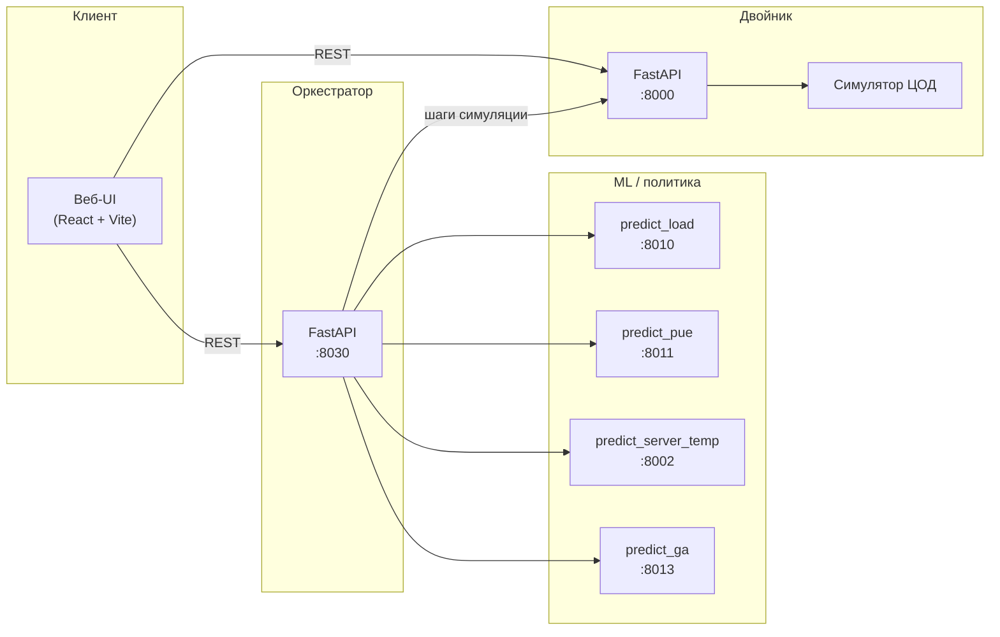

<div align="center">

# Цифровой двойник ЦОД и ML-оркестрация

**Физико-ориентированный симулятор серверной стойки, REST API, веб-интерфейс и контур машинного обучения для прогноза нагрузки, PUE, температуры серверов и замкнутого управления охлаждением.**

[](https://www.python.org/)
[](https://fastapi.tiangolo.com/)
[](https://react.dev/)
[](https://vitejs.dev/)
[](https://pytorch.org/)
[](https://www.docker.com/)
[](https://nginx.org/)
[](https://numpy.org/)
[](https://recharts.org/)

</div>

---

## Описание проекта

Репозиторий объединяет:

- **Цифровой двойник** — дискретная тепловая модель стойки, серверов, помещения и CRAC; шаг симуляции по API или из UI.
- **ML-сервисы** — отдельные HTTP-сервисы для прогноза нагрузки (Prophet / DeepAR), гибридного PUE и прогноза температуры серверов (LSTM), а также сервис **генетической политики** охлаждения (GA).
- **Оркестратор** — сценарные прогоны с периодическим управлением уставками CRAC по данным ML и правилам безопасности (в т.ч. режимы ML-прогона и GA-прогона).
- **Веб-приложение** — страницы быстрого прогона, полной конфигурации, ML- и GA-прогонов с графиками.

Подробная математическая формализация: [`DC_digital_twin/docs/mathematical_model.tex`](DC_digital_twin/docs/mathematical_model.tex). Блок-схема двойника в LaTeX: [`DC_digital_twin/docs/twin_block_diagram.tex`](DC_digital_twin/docs/twin_block_diagram.tex).

---

## Цифровой двойник

Двойник — это **дискретный по времени** симулятор одной **стойки** с $N$ серверами, **контуром охлаждения CRAC** и **моделью помещения** вокруг стойки. Один шаг симуляции соответствует вызову API (например `POST /simulation/step` с параметром `delta_time` в секундах) и обновляет температуры, мощности и метрики.

### Физико-логические блоки

| Блок | Смысл |
|------|--------|
| **Генератор нагрузки** | Задаёт утилизацию серверов $u_i \in [0,1]$: случайный процесс, константа, периодика или **загрузка из CSV-датасета** (`/datasets`, режим `dataset`). |
| **Стойка** | Геометрия (U-юниты), **рециркуляция воздуха** в зависимости от `containment` (none / hot_aisle / cold_aisle): матрица смешивания задаёт температуру на входе каждого сервера от выходов соседей и подачи CRAC. |
| **Сервер** | Тепловой баланс **чипа** (мощность от нагрузки, теплоотдача в воздух), модель **вентилятора сервера** (внутренняя эвристика), температуры входа/выхода воздуха. |
| **CRAC** | Управляемые **уставка** (`setpoint`) и **скорость вентиляторов** (`fan_speed`); расчёт подачи/возврата, отбираемой холодопроизводительности, **COP** чиллера от кривой и наружной температуры; режимы **free / chiller / mixed**. |
| **Помещение** | Энергобаланс зала: тепло от стоек, обмен со стенами, смешивание с подачей, инерция; обновление **температуры зала** и **возврата** к CRAC. |

### Реализм и конфигурация

- В конфиге и через API задаётся **режим реализма** (`realism`): динамическая мощность CRAC, клип температур зала и чипов и др. — чтобы поведение было ближе к «живой» установке без полной калибровки.
- Полная конфигурация симулятора доступна через **`GET/PUT /config`** (веб-форма «Конфигурация» или JSON); при сохранении симулятор **пересоздаётся**.
- Значения по умолчанию собраны в `DC_digital_twin/src/default_config.py`; опционально можно подставить YAML через переменную окружения `CONFIG_PATH`.

### API и метрики

Основные группы маршрутов FastAPI:

- **Симуляция** — сброс, шаг(и), остановка, текущее состояние.
- **Охлаждение и среда** — режим CRAC, уставка, скорость вентиляторов, наружные условия.
- **Нагрузка** — параметры случайной нагрузки или выбор датасета.
- **Телеметрия** — в т.ч. **PUE** (отношение суммарной мощности к мощности IT), **риск перегрева** (доля серверов выше порога по температуре чипа), мощности охлаждения и стоек.

Для интеграции с внешними системами предусмотрены **WebSocket** (телеметрия) и опциональный **MQTT** (по конфигу).

---

## ML-модели и оркестрация

ML вынесены в **отдельные HTTP-сервисы** с собственными артефактами (веса `.pt`/`.pkl`, метаданные JSON). **Оркестратор** не обучает модели: он на **тиках управления** (каждые `controlIntervalSteps` шагов симуляции) запрашивает прогнозы и на их основе меняет **уставку и/или вентиляторы CRAC** через API двойника.

### predict_load (:8010)

- **Назначение:** прогноз **суммарной нагрузки** (временной ряд) на горизонт **24–48 ч** в почасовом разрешении.
- **Модели:** **Prophet** и **DeepAR** (выбор через API, например `model_type`).
- **Роль в оркестраторе:** прогноз масштабируется к текущей суммарной мощности стойки и используется для оценки будущей энергетики; для связки с PUE обычно берётся окно первых **6 часов** прогноза.

### predict_pue (:8011)

- **Назначение:** рекомендация по **сдвигу уставки охлаждения** (`delta_c` °C) с учётом экономии энергии на горизонте.
- **Идея:** **физический baseline PUE** (`physics_pue.py`) + **LSTM** предсказывает **остаток** `residual = pue_real − pue_physics`; итоговый гибридный PUE и сценарии по уставке отдаются через **`POST /pue/hybrid/recommend`**.
- **Вход:** история и «будущие» ряды заданной длины (`input_hours` / `horizon_hours`); в оркестраторе в буфер попадают **последние 24 шага симуляции** (это 24 **шага**, а не обязательно 24 часа — см. `deltaTime` сценария).
- **Temp-aware PUE:** опционально включается гейт по **средней температуре чипа**: в коридоре вокруг цели не трогают рекомендацию ML; при перегреве запрещают поднимать уставку, при переохлаждении — опускать (параметры `tempAwarePue`, `chipTempTargetC`, `chipTempDeadbandC` в `POST /run`).

### predict_server_temp (:8002)

- **Назначение:** прогноз **температуры чипа** на горизонте **6 часов** для каждого сервера и оценка **неопределённости** и **вероятности перегрева** $P(t_\mathrm{chip} > \text{порог})$.
- **Модель:** **LSTM**; вход — тензор **`[servers, 24, 11]`** признаков (утилизация, история $t_\mathrm{chip}$, $t_\mathrm{in}$, уставка, вентилятор сервера, мощность, наружная температура, влажность, позиция сервера, sin/cos часа и т.д. — порядок фиксирован метаданными).
- **Роль в оркестраторе:** агрегированный риск перегрева сравнивается с порогом **`safetyMaxPOverheat`**; при превышении — **разгон вентиляторов CRAC** (например до `fanBoostSpeed`).

### predict_ga (:8013)

- **Назначение:** **готовая политика охлаждения**, обученная генетическим алгоритмом (код в `GA/`, веса — `GA/tuned_params.json`).
- **Режим GA-прогона:** на каждом тике управления вызывается **`POST /recommend`** (текущие $t_\mathrm{chip}$, уставка и т.д.); оркестратор подставляет рекомендованные **уставку и скорость вентиляторов**. **Прогноз нагрузки, PUE и LSTM температур в этом режиме не используются** (`POST /run/ga`).

### Поведение при сбоях ML

Если сервис недоступен, при **`failOnMlUnavailable: false`** (по умолчанию) прогон **продолжается** с пропуском соответствующего шага ML; в метаданных ответа может быть флаг вроде **`mlFallbackUsed`**. При `true` — ошибка клиента.

---

## Архитектура

На верхнем уровне данные идут **от сценария и конфигурации** в **симулятор (двойник)**; **оркестратор** на шагах управления вызывает **ML-сервисы** и задаёт уставки охлаждения; **веб-клиент** обращается к API двойника и к API оркестратора.



В **Docker Compose** все сервисы подключены к одной сети; оркестратор обращается к двойнику и ML по внутренним именам (`twin:8000`, `predict-load:8010`, …). Сборка фронта задаёт URL API через переменные `VITE_*` (куда ходит **браузер** пользователя).

---

## Сервисы

| Сервис | Порт (по умолчанию) | Назначение |
|--------|---------------------|------------|
| **twin** (`DC_digital_twin`) | **8000** | FastAPI: симуляция, конфиг `/config`, охлаждение, нагрузка, датасеты, телеметрия. |
| **predict-load** | **8010** | Прогноз временного ряда нагрузки (Prophet / DeepAR). |
| **predict-pue** | **8011** | Гибридная модель PUE (физика + нейросеть). |
| **predict-server-temp** | **8002** | Прогноз температуры серверов и риска перегрева (LSTM). |
| **predict-ga** | **8013** | Политика охлаждения на основе GA (`GA/`, `tuned_params.json`). |
| **orchestrator** | **8030** | Сценарные прогоны с вызовами ML и управлением уставками; `POST /run`, `POST /run/ga`. |
| **web** | **8080** → 80 в контейнере | Статическая сборка UI + nginx. |

Дополнительно в репозитории: каталог `GA/` (обучение и параметры политики), `models/rl/` (офлайн RL, по желанию), скрипты в `scripts/`.

---

## Запуск

### Вариант 1: Docker Compose (рекомендуется)

Из **корня репозитория**:

```bash
docker compose up --build -d
```

После старта:

- Веб-интерфейс: **http://127.0.0.1:8080**
- API двойника: **http://127.0.0.1:8000** (`GET /health`)
- Оркестратор: **http://127.0.0.1:8030** (`GET /health`)

Если UI открывается с другого хоста или порта, пересоберите фронт с нужными URL:

```bash
VITE_API_BASE=http://<хост>:8000 VITE_ORCHESTRATOR_BASE=http://<хост>:8030 docker compose build web
docker compose up -d web
```

Остановка: `docker compose down`.

---

### Вариант 2: Локальная разработка без Docker

1. **Виртуальное окружение Python** (в корне или в `DC_digital_twin`):

   ```bash
   cd DC_digital_twin
   python -m venv .venv && source .venv/bin/activate   # Windows: .venv\Scripts\activate
   pip install -r requirements.txt
   python run_api.py
   ```

   API слушает хост/порт из переменных `API_HOST` / `API_PORT` (по умолчанию `0.0.0.0:8000`).

2. **ML-сервисы и оркестратор** — отдельные терминалы, из корня репозитория с `PYTHONPATH=.`:

   ```bash
   uvicorn models.predict_load.api:app --host 127.0.0.1 --port 8010
   uvicorn models.predict_pue.api:app --host 127.0.0.1 --port 8011
   uvicorn models.predict_server_temp.api_fastapi:app --host 127.0.0.1 --port 8002
   PYTHONPATH=. uvicorn models.predict_ga.app:app --host 127.0.0.1 --port 8013
   PYTHONPATH=. uvicorn orchestrator.app:app --host 0.0.0.0 --port 8030
   ```

   Переменные окружения оркестратора по умолчанию указывают на `127.0.0.1` (см. `orchestrator/config.py`).

3. **Фронтенд**:

   ```bash
   cd DC_digital_twin/web
   npm install
   cp .env.example .env   # при необходимости поправьте VITE_API_BASE
   npm run dev
   ```

   В dev для страниц оркестратора Vite проксирует `/orchestrator` на `127.0.0.1:8030` (см. `vite.config.js`).

---

## Структура каталогов (кратко)

| Каталог | Содержимое |
|---------|------------|
| `DC_digital_twin/` | Симулятор, FastAPI, веб (`web/`) |
| `models/` | `predict_load`, `predict_pue`, `predict_server_temp`, `predict_ga`, ноутбуки-шаблоны в `notebooks/` |
| `orchestrator/` | Оркестратор прогонов |
| `GA/` | GA-ядро, обучение, `tuned_params.json` |
| `docker-compose.yml` | Единый compose всего стека |

---

## Лицензия и заметки

Используйте конфигурацию и эндпоинты в соответствии с политикой вашей среды. При публикации репозитория не коммитьте секреты и локальные `.env`.
